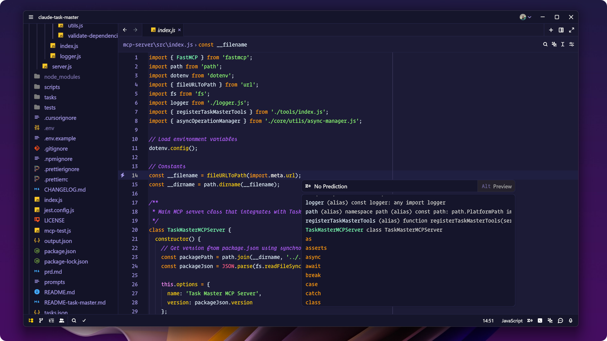

<h1 align="center">

Shades of Purple Theme for [Zed](https://zed.dev/)

</h1>

Icon Theme: [Monospace Icon Theme](https://github.com/irmhonde/monospace-icon-theme)

Icon Theme: [Monospace Icon Theme](https://github.com/irmhonde/monospace-icon-theme)

## Usage

1. Open Zed.
2. Open the command palette (<kbd>Cmd</kbd>+<kbd>Shift</kbd>+<kbd>P</kbd>) and enter _zed: extensions_.
3. Search for the _Shades of Purple Theme_ extension and install.
4. Enter _theme selector: toggle_ in the command palette and select the Shades of Purple theme in your preferred flavor in the dropdown.

---

This theme is derived from the [Shades of Purple Theme](https://github.com/ahmadawais/shades-of-purple-vscode) for VSCode and is distributed under its original [LICENSE](LICENSE).

