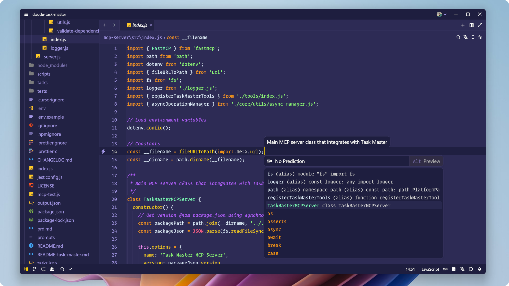

<h1 align="center">
  Shades of Purple Theme for Zed
</h1>

Icon Theme: [Monospace Icon Theme](https://github.com/irmhonde/monospace-icon-theme)

Icon Theme: [Monospace Icon Theme](https://github.com/irmhonde/monospace-icon-theme)

## Limitations

While significant effort has been made to replicate the original aesthetic, Zed's current theming engine and API have certain limitations compared to the extensive customization options available in VS Code.

Consequently, you may observe subtle variations in:

- **Syntax Highlighting Nuances:** Specific scopes or language elements might not be colored identically due to differences in how Zed tokenizes code or the available targeting options within its theme format.
- **UI Element Coloring:** Certain UI components, panels, or decorative elements may not fully match the VS Code theme's coloring. Zed's theming API does not expose granular control over those specific areas.
- **Semantic Highlighting:** The degree and precision of semantic highlighting (coloring based on symbol meaning rather than just syntax) will differ depending on Zed's built-in language server capabilities and theme integration points.

I have aimed to capture the core look and feel as closely as possible within the constraints of Zed's current theming capabilities. As Zed's theming API matures, updates may be released to improve fidelity where possible.

---

These theme is derived from the [Shades of Purple Theme](https://github.com/ahmadawais/shades-of-purple-vscode) for VSCode and is distributed under its original [LICENSE](LICENSE.md).

